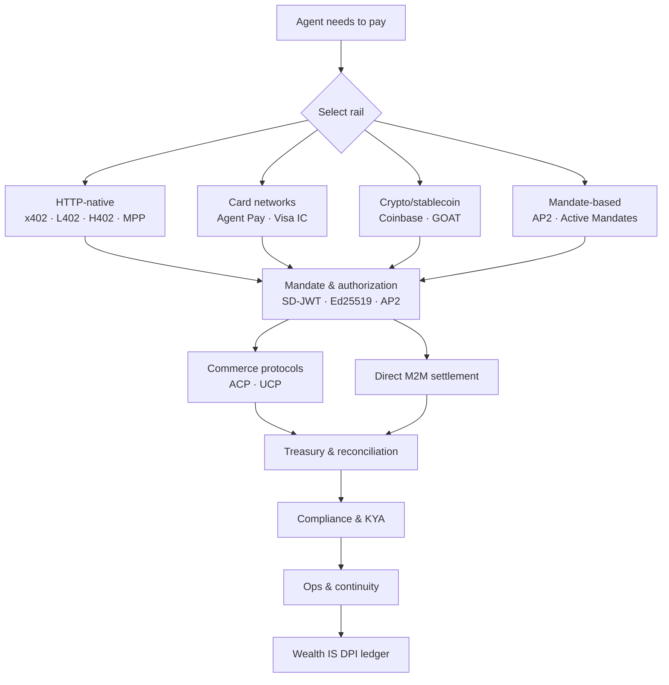

# Payment Intelligence System

> **Non-advisory clause:** This is system architecture, not financial, legal, or tax advice. PSP terms of service and jurisdiction-specific counsel govern instruments; the operator accepts settlement and regulatory risk; the substrate accepts no claim.

The complete agentic-payments intelligence layer for 2026 — six operational sub-systems covering every dimension of how AI agents pay, get paid, authorize spending, comply with regulation, and recover when things break. Built to the SIP standard, composing under Wealth IS.

---

## Daily-5 commands

The five commands that cover 80% of operator needs. Start here.

```bash
/pay-rails-select      # Choose the right payment rail for your context
/pay-mandate-design    # Design an agent authorization with spend caps + revocation
/pay-commerce-readiness # Audit your shop or API for agent-payment readiness
/pay-compliance-map    # Map what law requires in your jurisdiction
/pay-ops-runbook       # Build your payment operations runbook
```

---

## 2026 agentic-payments landscape



---

## Six sub-systems

| Sub-system | Slug | What it covers | Entry command |
|---|---|---|---|
| **Rails** | `rails` | Which protocol moves the value: x402, L402, H402, Stripe MPP, Mastercard Agent Pay, Visa IC, AP2, stablecoin, SEPA/ACH | `/pay-rails-select` |
| **Mandates & Authorization** | `mandates` | How agents are authorized to spend: AP2, Active Mandates, SD-JWT, Ed25519, Byzantine consensus, revocation | `/pay-mandate-design` |
| **Commerce & Checkout** | `commerce` | Shops selling to agents + agents buying: ACP, UCP, MCP endpoint monetization, checkout traces | `/pay-commerce-readiness` |
| **Treasury & Wallets** | `treasury` | Where value lives: wallet tiers, float/liquidity, reconciliation, bridge to Wealth IS DPI | `/pay-treasury-design` |
| **Compliance & Tax** | `compliance` | What law requires: PSD3, MiCA, AI Act, US money-transmission, KYC/AML, KYA, VAT/sales-tax | `/pay-compliance-map` |
| **Ops & Continuity** | `ops` | What happens when things break: runbooks, disputes/chargebacks, processor outages, deplatform recovery | `/pay-ops-runbook` |

---

## 24 commands

| Rails | Mandates | Commerce | Treasury | Compliance | Ops |
|---|---|---|---|---|---|
| `/pay-rails-select` | `/pay-mandate-design` | `/pay-commerce-readiness` | `/pay-treasury-design` | `/pay-compliance-map` | `/pay-ops-runbook` |
| `/pay-rails-brief` | `/pay-mandate-audit` | `/pay-commerce-protocol-fit` | `/pay-float-plan` | `/pay-kya-check` | `/pay-incident` |
| `/pay-rails-compare` | `/pay-consensus-policy` | `/pay-monetize-endpoint` | `/pay-reconcile` | `/pay-tax-pack` | `/pay-continuity-audit` |
| `/pay-rails-watch` | `/pay-revocation-drill` | `/pay-checkout-trace` | `/pay-wealth-bridge` | `/pay-aml-screen` | `/pay-dispute-flow` |

---

## Protocols covered

**HTTP-native rails:** x402 (~165M agent txns as of 2026-06, x402 Foundation with Visa/Mastercard/Stripe/Google/Cloudflare/Coinbase) · L402 (Lightning Network, macaroon credentials) · H402 (independent M2M) · Stripe MPP (Machine Payments Protocol, session-based streaming, Mar 2026)

**Card-network rails:** Mastercard Agent Pay (SD-JWT verifiable intent credentials, Apr 2025) · Mastercard Agent Pay for Machines (M2M mandate layer, Jun 2026) · Visa Intelligent Commerce + Trusted Agent Protocol (RFC 9421 HTTP Message Signatures)

**Mandate frameworks:** Google AP2 (signed mandates, 60+ partners as of 2026-06) · Active Mandates lifecycle (Ed25519, Byzantine consensus, instant revocation)

**Commerce protocols:** ACP (Agentic Commerce Protocol, OpenAI + Stripe) · UCP (Universal Commerce Protocol, Google + Shopify)

**Provider toolkits:** Stripe AI (agent-toolkit + MCP server) · PayPal (30+ MCP tools as of 2026-06) · Coinbase AgentKit · GOAT SDK · Amazon Bedrock AgentCore Payments (preview, Apr 2026) · Nevermined

**Identity & trust:** KYAPay (Skyfire, Know-Your-Agent + JWT) · Visa TAP (RFC 9421) · Forter TACP · Sigilum (PaymanAI)

---

## Composition

Composes under **Wealth IS** as a Domain Sub-Stack:
- Treasury → **Wealth IS / DPI ledger** (via `/pay-wealth-bridge` → `/wealth-dpi`)
- Compliance + Mandates → **Wealth IS / Thesis engine** (capital-control layer)
- Sibling: **Crypto IS** (crypto rail + custody patterns bidirectional)

---

## Architecture

```
payment-intelligence-system/
├── README.md          This file
├── CLAUDE.md          Operating instructions + command index
├── QUICK-START.md     Status table + 30-60 min entry
├── SKILL.md           Wrapper skill, 5 invariants, disclaimer gate
├── SOUL.md            Evidence standards, theater patterns refused
├── AGENTS.md          Voice map: architect/defender/implementer/overseer
├── MEMORY.md          Identity, composition map, pre-publish checklist
├── STACK.md           Composition declarations: Wealth IS + Crypto IS
├── CANON.md           None required at v1.0
├── SUB-SYSTEMS.md     Canonical 6-sub-system map with daily-5 + falsifier
├── PROPOSAL.md        VERTICALS.md registry entry for Starlight board
├── frameworks/
│   ├── rail-selection-matrix.md    Rail decision framework
│   └── mandate-design-checklist.md Mandate design checklist
├── research/          Per-protocol research docs (verified 2026 facts)
│   ├── rails/         x402, L402, H402, Stripe MPP, Agent Pay, Visa IC
│   ├── mandates/      AP2, Active Mandates, KYAPay, a2a-x402
│   ├── commerce/      ACP, UCP
│   ├── toolkits/      Provider toolkits landscape
│   ├── identity/      KYA and trust protocols
│   └── compliance/    EU 2026, US 2026
├── rails/             Sub-system: agent.md + skill.md + knowledge.md
├── mandates/          Sub-system: agent.md + skill.md
├── commerce/          Sub-system: agent.md + skill.md
├── treasury/          Sub-system: agent.md + skill.md
├── compliance/        Sub-system: agent.md + skill.md
├── ops/               Sub-system: agent.md + skill.md
└── .claude/commands/  24 /pay-* commands
```

---

**Built on SIP** — Payment Intelligence System · v1.0 · SIP v1.1.0 (spawned 2026-06-22)

*Composes-with: Wealth IS / DPI ledger · Wealth IS / Thesis engine · Crypto IS (sibling)*
